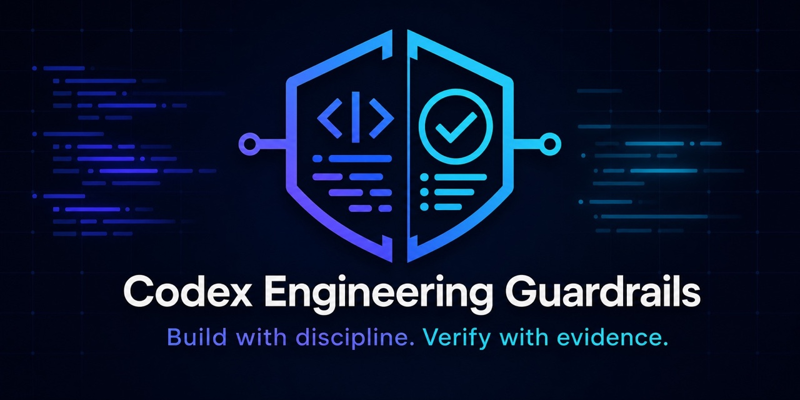

# Code Work

Скилл Codex для реализации кода в строгих границах задачи и с проверкой результата тестами.

Code Work помогает Codex реализовывать функции, исправлять дефекты, выполнять рефакторинг и миграции, сохраняя утверждённый пользователем объём работ. Основные принципы — понимание конкретного репозитория, поиск первопричины, небольшие согласованные изменения и свежие доказательства проверки.

[English README](README.md) · [Быстрый старт](docs/quickstart.md) · [Примеры](examples/README.md) · [Поддержка](SUPPORT.md) · [Услуги](SERVICES.md)



## Для каких задач предназначен скилл

Используйте Code Work, когда задача прямо разрешает менять production-код или другие файлы реализации. Скилл требует от Codex:

- считать явное решение пользователя главным контрактом;
- до редактирования изучить инструкции репозитория и текущие изменения;
- перед исправлением дефекта найти отвечающий за него механизм;
- реализовать минимальный целостный и проверяемый фрагмент;
- выбрать проверки, действительно затрагивающие изменённое поведение;
- сообщить свежие доказательства, ограничения и намеренно не изменённые находки.

Скилл не даёт разрешения на деплой, публикацию, push, commit, изменение live-систем, удаление данных или самостоятельное расширение задачи.

## Адаптивная параллельная работа

Code Work может использовать параллельное выполнение, когда модель и среда предоставляют подходящие ресурсы. Это оптимизация, а не обязательное условие. Скилл сначала разделяет зависимые и независимые работы, а затем применяет ограничения:

- начальный лимит — от двух до четырёх исполнителей;
- параллельно выполняются read-only исследование, независимые компоненты или изолированные проверки;
- у каждой области записи есть только один ответственный исполнитель;
- общие контракты, схемы, lock-файлы, сервисы, порты и другое совместное состояние обрабатываются последовательно;
- при нехватке ресурсов или изоляции применяется тот же workflow последовательно;
- объединённый результат проверяется напрямую, а не только по отчётам исполнителей.

Эти правила предназначены для сохранения корректности и границ задачи. Репозиторий не заявляет универсального ускорения или повышения качества благодаря параллельному выполнению.

## Установка с GitHub

Используйте встроенный в Codex `skill-installer`. Для стандартного домашнего каталога Codex:

```bash
python3 ~/.codex/skills/.system/skill-installer/scripts/install-skill-from-github.py \
  --repo Comdir2/Codex-code-work \
  --path . \
  --name code-work
```

Если домашний каталог Codex отличается от `~/.codex`, укажите соответствующий путь к встроенному установщику. После установки перезапустите Codex, чтобы обновился каталог скиллов.

Первый запуск и проверка установки описаны в [быстром старте](docs/quickstart.md).

## Использование

Для явного включения workflow укажите скилл в запросе:

```text
Используй $code-work и исправь повторное создание счёта. Не меняй публичный
API, добавь точечный регрессионный тест, запусти затронутый набор тестов,
ничего не деплой и не меняй соседний платёжный код.
```

После установки Codex также может автоматически выбрать скилл для подходящей задачи по разработке. Явный вызов особенно полезен, когда важны точные границы, доказательства или ограничения выполнения.

Ожидаемый процесс:

1. определить критерии приёмки, границы, инварианты, риски и необходимые доказательства;
2. изучить инструкции репозитория, его состояние, путь исполнения и настройки тестов;
3. воспроизвести дефект или найти публичную точку внедрения функции;
4. внести небольшое целостное изменение и выполнить точечные проверки;
5. изучить diff и провести соразмерную более широкую проверку;
6. передать результат с описанием поведения, доказательств, допущений и оставшихся рисков.

Реалистичные запросы и ожидаемые workflows приведены в [примерах](examples/README.md).

## Связь с Code Verification

Code Work отвечает за реализацию. [Code Verification](https://github.com/Comdir2/Codex-code-verification) — отдельный read-only скилл для независимого ревью, тестирования, диагностики, анализа покрытия и оценки готовности выпуска.

Для более строгого процесса сначала поручите Code Work реализовать разрешённое изменение, а затем запустите отдельную проверку через `code-verification`. Такое разделение помогает проверить требования и доказательства без скрытого расширения реализации.

## Документация

- [Быстрый старт](docs/quickstart.md)
- [Примеры запросов](examples/README.md)
- [Руководства по инженерным решениям](references/engineering-decisions.md)
- [История изменений](CHANGELOG.md)
- [Как внести вклад](CONTRIBUTING.md)
- [Поддержка](SUPPORT.md)
- [Дополнительные профессиональные услуги](SERVICES.md)

## Бенчмарки

В этом README нет заявлений об улучшении производительности или корректности. Воспроизводимый набор сценариев и методология опубликованы в [Codex Engineering Guardrails / benchmark](https://github.com/Comdir2/Codex-engineering-guardrails/tree/main/benchmark). Текущий валидатор подтверждает целостность fixtures и известные baseline-состояния, но не запускает и не оценивает модель. Будущие результаты моделей следует рассматривать только вместе со сценариями, окружением, записями запусков и ограничениями.

## Лицензия

Code Work распространяется по [MIT License](LICENSE). Открытый скилл можно бесплатно использовать, изменять, распространять и включать в коммерческие проекты при соблюдении лицензии. Дополнительная поддержка и услуги не меняют лицензию публичного репозитория.

## Статус и независимость проекта

Первая документированная версия — `v1.0.0`. Её состав указан в [истории изменений](CHANGELOG.md).

Это независимый проект сообщества. Он не является официальным продуктом OpenAI или GitHub и не одобрен этими компаниями.
